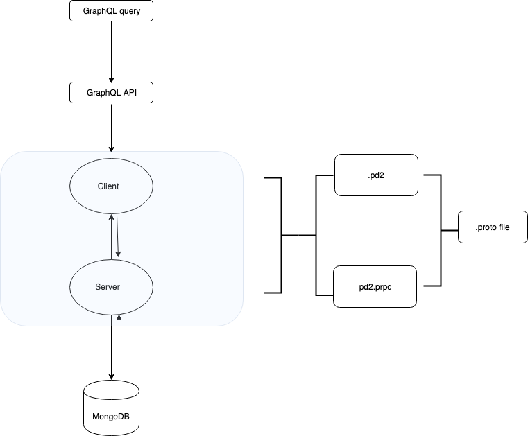

**gRPC - An RPC library and framework**
===================================

gRPC is a modern, open source, high-performance remote procedure call (RPC) framework that can run anywhere. gRPC enables client and server applications to communicate transparently, and simplifies the building of connected systems.

**What we are trying to accomplish:**

```
- Setup basic search and insert into MongoDB using grpc
- Implement UI
- Implement JWT
- Implement GraphQL
- Better Indexing for MonogDB
- Logging (last)
- Metrics (last)
```

**Setup env**
```$ python -m pip install virtualenv
$ virtualenv venv
$ source venv/bin/activate
$ python -m pip install --upgrade pip
$ python setup.py install (located in the base path)
```

**Install gRPC**
```$ sudo python -m pip install grpcio```

**Install gRPC tools**
```$ python -m pip install grpcio-tools```

**Run a gRPC application**
From respective server and client directory:

**Run the server**
```$ python addressbook_server.py```

**Run the client**
```$ python addressbook_client.py```

**create stub from proto file**
```$ python -m grpc_tools.protoc -I../../protos --python_out=. --grpc_python_out=. addressbook.proto```

**Note**
https://www.grpc.io/docs/quickstart/python/

**Start the app and mongo db**
```docker-compose up --build```

(ensure port in the docker file for address_book and the addressbook_client is same)

```--no-deps``` - Don't start linked services.

```--build``` - Build images before starting containers.

**MongoDB on mac**

Use:

1. MongoDB Compass 
2. ```brew install mongodb```

**Arcitectural diagram**

